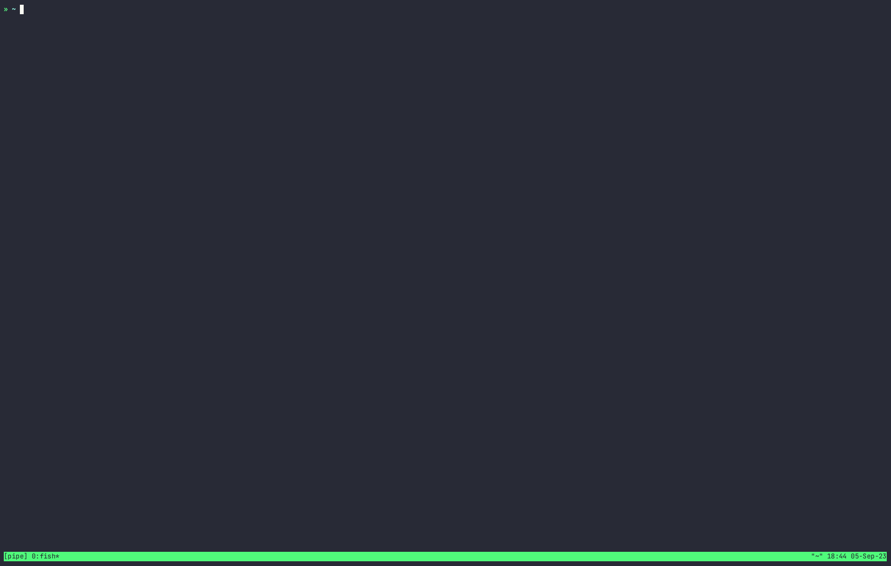

<!-- TOC start (generated with https://github.com/derlin/bitdowntoc) -->

- [Gnar: A Versatile Proxy Tool with Auto-HTTPS Subdomain Support](#gnar-a-versatile-proxy-tool-with-auto-https-subdomain-support)
  - [Features](#features)
  - [Installation](#installation)
  - [Quick Start](#quick-start)
  - [Configuration](#configuration)
    - [Command line flags](#command-line-flags)
    - [Client](#client)
    - [Server](#server)
  - [Advanced Usage](#advanced-usage)
    - [Subdomain Proxy](#subdomain-proxy)
    - [Deploying on `fly.io`](#deploying-on-flyio)
  - [Trubleshooting](#trubleshooting)
  - [Contributing](#contributing)
  - [License](#license)

<!-- TOC end -->

<!-- TOC --><a name="gnar"></a>
# Gnar: A Versatile Proxy Tool with Auto-HTTPS Subdomain Support



Gnar is a powerful and flexible __proxy__ tool, similar to frp, with built-in support for __Auto-HTTPS__ subdomain proxying. It's designed to be simple yet feature-rich, making it an ideal solution for developers who need a reliable and secure proxy setup.

## Features

- Simple implementation with __minimal__ third-party dependencies
- Support for __TCP/UDP__ traffic forwarding
- __Subdomain proxy__ using Caddy server
- Configurable via __command-line flags__ or a __configuration file__
- __Multi-client__ forwarding support
- Token-based __authentication__ for enhanced security
- Server-side __admin panel__ for easy management
- Integration of __yamux__ for __multiplexing__ connections
- Deployable on __fly.io__

## Installation

```
git clone https://github.com/abcdlsj/gnar
make
```

## Quick Start

1. Start the server:
   ```bash
   gnar server -p 8910
   ```

2. Start a sample service:
   ```bash
   python3 -m http.server 3000
   ```

3. Start the client proxy:
   ```bash
   gnar client -s localhost:8910 -l 3000 -u 9001
   ```

4. Access your service at `host:9001`

## Configuration

Gnar supports both command-line flags and configuration files. Here's a sample client configuration:

### Command line flags

```
gnar is a proxy tool.

Usage:
  gnar [flags]
  gnar [command]

Available Commands:
  client      
  completion  Generate the autocompletion script for the specified shell
  help        Help about any command
  server      

Flags:
  -h, --help      help for gnar
  -v, --version   version for gnar

Use "gnar [command] --help" for more information about a command.
```

### Client

Command line flags:
```shell
Usage:
  gnar client [flags]

Flags:
  -c, --config string        config file
  -h, --help                 help for client
  -l, --local-port int       local port
  -m, --multiplex            multiplex client/server control connection
  -n, --proxy-name string    proxy name
  -y, --proxy-type string    proxy transport protocol type (default "tcp")
  -u, --remote-port int      proxy port
  -s, --server-addr string   server addr (default "localhost:8910")
      --speed-limit string   speed limit
  -d, --subdomain string     subdomain
  -t, --token string         token
```

Toml config:
```toml
server-addr = "localhost:8910"
token = "abcdlsj" # optional
multiplex = true // optional, if true will use yamux to multiplex the connection

[[proxys]]
proxy-name = "python_http_file_service" # optional
subdomain = "python3-http" # optional, if not, will generate a random subdomain prefix
local-port = 3000
remote-port = 9001
speed-limit = "100kb" // optional, if not, will not limit speed
proxy-type = "tcp"

[[proxys]]
local-port = 3001
remote-port = 9002
proxy-type = "tcp"
```

### Server

Command line flags:
```shell
Usage:
  gnar server [flags]

Flags:
  -a, --admin-port int   admin server port
  -c, --config string    config file
  -D, --domain string    domain name
  -d, --domain-tunnel    enable domain tunnel
  -h, --help             help for server
  -m, --multiplex        multiplex client/server control connection
  -p, --port int         server port (default 8910)
  -t, --token string     token
```

Toml config:
```toml
port = 8910
admin-port = 8911
domain-tunnel = false
domain = "example.com"
# token = "abcdlsj" # optional
```

## Advanced Usage

### Subdomain Proxy

1. Set up your domain's DNS records:
   ```
   A *.example.com <your server ip>
   A example.com <your server ip>
   ```

2. Start the Caddy server:
   ```bash
   caddy run --config <gnar path>/server/caddy.json
   ```

3. Run the Gnar server with domain tunnel enabled:
   ```bash
   gnar server -a 8911 -D example.com -d -p 8910
   ```

4. Start the client with a custom subdomain:
   ```bash
   gnar client -s localhost:8910 -l 3000 -u 9001 -d myapp
   ```

### Deploying on `fly.io`

Gnar can be easily deployed on <https://fly.io>.

You can edit `entrypoint.sh` to start your own server **you need to special set forward port.**

Example:
```toml
# See https://fly.io/docs/reference/configuration/ for information about how to use this file.
app = "xxxx"
primary_region = "hkg"

[build]

# Control
[[services]]
  internal_port = 8910
  protocol = "tcp"

  [[services.ports]]
    port = 8910
  
# Admin
[[services]]
  internal_port = 8911
  protocol = "tcp"

  [[services.ports]]
    handlers = ["http"]
    port = 80

  [[services.ports]]
    handlers = ["tls", "http"]
    port = 443

# Forward TCP
[[services]]
  internal_port = 9000
  protocol = "tcp"

  [[services.ports]]
    handlers = ["tls", "http"]
    port = 9000
```
This can view `xxxx.fly.dev:9000` and then view your own internal server.

## Trubleshooting

1. subdomain proxy not work

  make sure you have set the dns record to your server ip. 
  if you use cloudflare, need to set dns_key in caddy.json.

## Contributing

We welcome contributions to Gnar! Please read our [Contributing Guidelines](CONTRIBUTING.md) for more information on how to get started.

## License

Gnar is released under the [MIT License](LICENSE).