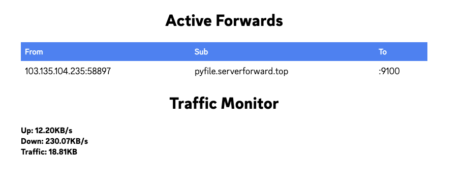

# Pipe

[](https://asciinema.org/a/606328)
**Do not destroy the server!!!**

frp-like Tool with AutoHTTPs Subdomain Proxy

Features:
- [x] Simple implementation with minimal third-party dependencies
- [x] Support for subdomain proxy using Caddy server
- [x] Can be run via command-line flags or a configuration file
- [x] Supports forwarding from multiple clients
- [x] Includes token-based authentication for added security
- [x] Server-side admin panel (currently, it's simple)

Future Plans:

- [ ] Daemon mode for background execution
- [ ] Integration of yamux for multiplexing connections

## Install

```
git clone https://github.com/abcdlsj/pipe
make
```

## Usage

```
pipe is a frp like tool.

Usage:
  pipe [flags]
  pipe [command]

Available Commands:
  client     
  server      
  completion  Generate the autocompletion script for the specified shell
  help        Help about any command

Flags:
  -h, --help      help for pipe
  -v, --version   version for pipe

Use "pipe [command] --help" for more information about a command.
```

## Client
```
Usage:
  pipe client [flags]

Flags:
  -c, --config string        config file
  -u, --forward-port int     forward port
  -h, --help                 help for client
  -l, --local-port int       local port
  -n, --proxy-name string    proxy name
  -s, --server-host string   server host (default "localhost")
  -p, --server-port int      server port (default 8910)
  -d, --subdomain string     subdomain
  -t, --token string         token
```

## Server 
```
Usage:
  pipe server [flags]

Flags:
  -a, --admin-port int   admin server port
  -c, --config string    config file
  -D, --domain string    domain name
  -d, --domain-tunnel    enable domain tunnel
  -h, --help             help for server
  -p, --port int         server port (default 8910)
  -t, --token string     token
```

### Server admin panel



## Simple Start

Server
```
pipe server -p 8910
```

Client
```
# start a service
python3 -m http.server 3000
# start forward
pipe client -s localhost -p 8910 -l 3000 -u 9001
```

view `host:9001` and you will see the service.

## Subdomain proxy

1. make sure you have a domain and set the dns record to your server ip.

```
A *.example.com <your server ip>
A example.com <your server ip> (`@` is ok too)
```

2. start caddy server
```
[sudo] caddy run --config <pipe path>/server/caddy.json
```

3. start pipe server with `domain-tunnel` flag
```
./pipe server -a 8911 -D <example.com> -d -p 8910
``` 

4. start pipe client
```
./pipe client -s localhost -p 8910 -l 3000 -u 9001
```

5. now you can find the subdomain in server log, like this
```
2023/07/02 09:50:16 [INFO] Tunnel created successfully, id: 3ec8f1b-9001, host: 3ec8f1b.xxx.xxx
```

6. visit `3ec8f1b.xxx.xxx` and you will see the service.


## Trubleshooting

1. subdomain proxy not work
make sure you have set the dns record to your server ip. 
if you use cloudflare, need to set dns_key in caddy.json.