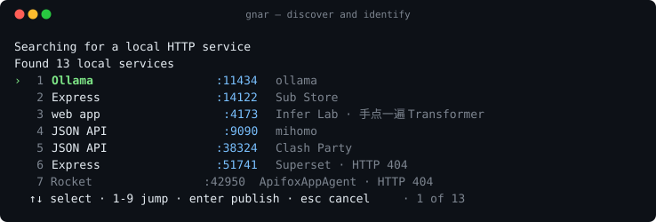
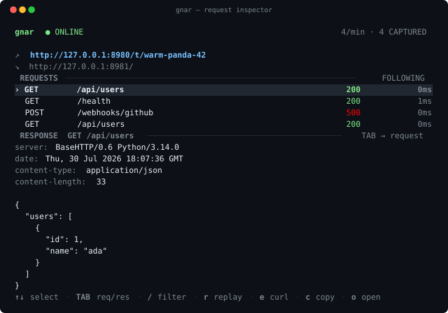

# gnar

gnar publishes a local HTTP service to the internet and shows incoming requests in an interactive terminal inspector. HTTP requests keep their original Host header by default, and WebSocket connections are relayed in both directions.

Run `gnar` without a target to discover local services:



Inspect, filter, replay, and export requests from the terminal:



## Install

Install the latest release on macOS or Linux:

```console
$ curl --proto '=https' --tlsv1.2 -LsSf https://raw.githubusercontent.com/abcdlsj/gnar/master/install.sh | sh
```

The installer supports Apple Silicon Macs and x86_64 or arm64 Linux machines. It installs `gnar` to `$HOME/.local/bin`.

Set `GNAR_INSTALL_DIR` to use another directory. Set `GNAR_VERSION` to install a specific release:

```console
$ curl --proto '=https' --tlsv1.2 -LsSf https://raw.githubusercontent.com/abcdlsj/gnar/master/install.sh \
    | GNAR_VERSION=1.3.0 sh
```

## Quick start

gnar needs an edge server. Sign in to a self-hosted edge before publishing:

```console
$ gnar login --edge https://gnar.example.com
```

Start a local application, then run:

```console
$ gnar
```

The discovery list marks services that answer WebSocket upgrades, speak gRPC,
or stream Server-Sent Events with a small `[WS]`, `[gRPC]`, or `[SSE]` badge.

You can also provide a port, URL, or endpoint name:

```console
$ gnar 3000
$ gnar http://127.0.0.1:3000
$ gnar 3000 --name checkout
```

When several local services are available, gnar asks which service to publish. After confirming that service is reachable, gnar chooses the edge as follows:

- One signed-in edge is selected automatically.
- Several signed-in edges are shown in an interactive selection.
- `--edge` or `GNAR_EDGE` selects an edge explicitly and skips the selection.
- No available edge stops the command and explains how to self-host and sign in.
- A non-interactive command with several signed-in edges requires `--edge` or `GNAR_EDGE`.

gnar does not use a public edge by default.

## Commands

```text
gnar [target]                 discover or publish a local HTTP service
gnar login                    sign in to an edge and store its token
gnar logout                   forget the stored token for an edge
gnar whoami                   show the signed-in account for an edge
gnar release <name>           release a reserved endpoint name
gnar key add <name>           create or update an invite key
gnar key list                 list configured invite keys
gnar key revoke <name>        remove an invite key
gnar key show <name>          display an invite key's secret
gnar serve                    run a self-hosted edge
gnar version                  print version information
```

Common options:

```text
--name <name>                 request a readable endpoint name
--edge <url>                  use a specific edge
--no-tui                      use streaming plain output
--json                        emit newline-delimited JSON events
--preserve-host <bool>        keep the original Host header (default true)
--websocket <bool>            relay WebSocket connections (default true)
--max-request-mib <mib>       request body limit for this tunnel (default 16)
--response-timeout-secs <s>   local response head timeout (default 30)
--max-concurrent <n>          concurrent exchanges per tunnel (default 64)
--requests-per-minute <n>     request budget per tunnel (default 600)
```

A bare edge such as `127.0.0.1:8910` uses HTTP. Public edge servers should use HTTPS.

## Sign in

Each edge manages its own accounts. Sign in with the device flow:

```console
$ gnar login --edge https://gnar.example.com
Open https://gnar.example.com/device and enter code  WDJB-MJHT
Waiting for approval…
✓ Signed in as alice
```

gnar stores one token for each signed-in edge in the user's configuration directory. The credentials file is readable only by that user.

Signing in provides reserved endpoint names and higher quotas. Anonymous publishing remains available when the edge operator allows it.

For a Warren Headless setup, bootstrap an account without opening the device page:

```console
$ gnar login --edge https://gnar.example.com --account owner \
    --enrollment-key-stdin --json < /path/to/approval-secret
```

The command consumes the approval/enrollment key once from stdin, emits status as
newline-delimited JSON, and never prints the key or the issued token. The key is
bootstrap-only; gnar stores the resulting account token in its per-user
credentials file. Keep both credentials out of the edge URL.

Use the same edge when managing an account or endpoint explicitly:

```console
$ gnar whoami --edge https://gnar.example.com
$ gnar logout --edge https://gnar.example.com
$ gnar release checkout --edge https://gnar.example.com
```

## Invite keys

Invite keys let an edge operator hand out a shared secret that anyone can use
to create an account without opening the device page. The edge watches
`keys.json` in the working directory by default (`--keys-file` or
`GNAR_KEYS_FILE` to change) and reloads it within about a second, so adding,
editing, or removing keys does not restart the edge.

Create a key:

```console
$ gnar key add demo --max-uses 3 --expires-in 7d
Key demo -> account demo, max 3 uses, expires 1780000000
Secret stored in the keys file; run `gnar key show demo` to display it
```

The secret is not printed by default so it stays out of terminal scrollback
and logs. Pass `--show-secret` to print it once during creation, or use
`gnar key show demo` later.

The underlying file looks like this:

```json
{
  "keys": {
    "demo": {
      "secret": "AB12-CD34-EF56",
      "max_uses": 3,
      "expires_at": 1780000000,
      "account": "demo"
    }
  }
}
```

`account` defaults to the key name, `max_uses` defaults to 1, and
`expires_at` is an optional Unix timestamp. When an account name is already
taken, gnar appends a random 4-character suffix for every registration path,
including device approval, enrollment, and invite keys, so the second user of
`demo` signs in as something like `demo-x7k2`.

Hand the secret to a user and they register with one command:

```console
$ gnar login --edge https://gnar.example.com --key-stdin < secret.txt
✓ Signed in as demo-x7k2
```

Keep the secret out of shell history and logs; write it to a private file or
pipe it from a secret manager instead of putting it on the command line.

Removing a key from the file stops new signups immediately. Existing account
tokens stay valid; the key file is written with owner-only permissions, and
the edge refuses to load a key file that is readable or writable by group or
others. The edge stores only a hash of each key.

## Request inspector

The interactive inspector provides these actions:

- Select a request and inspect its response.
- Switch between request and response details.
- Filter by method, path, or status.
- Long request and response bodies show their first 12 lines. This limit only affects the inspector display.
- Replay a request against the local service.
- Export a request as a curl command.
- Copy or open the public URL.
- Press `s` to edit per-tunnel forward settings.

Use `--no-tui` for stable plain output. Use `--json` for newline-delimited JSON events.

## Forward settings

Press `s` in the inspector to open the forward settings form. Toggle boolean
fields with ENTER, edit numeric fields with digits and ENTER, then save with
`S` (or Ctrl+S). Saving reconnects the tunnel so the new limits apply to every
exchange.

- **Preserve Host**: keep the original Host header when forwarding. When off,
  the header is rewritten to the local target.
- **WebSocket forwarding**: accept public WebSocket upgrades and relay frames
  in both directions.
- **Max request body**: defaults to 16 MiB; the edge clamps requests to
  [1 MiB, 256 MiB].
- **Response head timeout**: defaults to 30 seconds; the edge clamps to
  [1, 300] seconds.
- **Max concurrent exchanges**: defaults to 64; the edge clamps to [1, 512].
- **Requests per minute**: defaults to 600; the edge clamps to the account or
  anonymous quota.

The same values are available as command-line options, which is useful for
non-interactive runs.

WebSocket forwarding is bounded independently from HTTP exchanges. Each frame
and relayed message is limited to 4 MiB. The parser rejects fragmented input
above 16 MiB before it reaches the relay, and each connection has a 5-minute
heartbeat timeout. The edge defaults to 32 concurrent WebSocket exchanges,
1 GiB and 100,000 frames per connection per minute. Tune
`--websocket-concurrent`, `--websocket-idle-timeout-secs`,
`--websocket-bytes-per-minute-mib`, and `--websocket-frames-per-minute` for a
larger self-hosted deployment. Relay queues are bounded, so a slow peer closes
only its WebSocket instead of growing memory without a limit.

## Self-host an edge

### Run the binary

Start an edge for local use:

```console
$ gnar serve
```

The interactive setup asks whether the edge allows anonymous publishing or requires accounts. Account mode uses one approval/enrollment secret for the device verification page and headless enrollment, and requires every tunnel owner to sign in. Public tunnel URLs remain accessible without signing in.

For a non-interactive account-enabled deployment, provide the secret explicitly:

```console
$ GNAR_APPROVAL_SECRET='replace-this-secret' \
    gnar serve \
    --listen 127.0.0.1:8910 \
    --public-url https://gnar.example.com \
    --database gnar.db
```

The same deployment can accept invite keys by adding entries to `keys.json`;
the edge picks them up without a restart. Use `--keys-file` to point at a
different path and `--anonymous-only` to disable both approval and invite
enrollment.

### Run with Docker

The published container runs as a non-root user and stores persistent state in `/data`:

```console
$ docker run -d --name gnar --restart unless-stopped \
    --env-file /path/to/gnar.env \
    -p 127.0.0.1:8910:8910 \
    -v gnar-data:/data \
    ghcr.io/abcdlsj/gnar:latest \
    serve \
    --listen 0.0.0.0:8910 \
    --public-url https://gnar.example.com \
    --database /data/gnar.db \
    --allow-public-bind
```

Put an HTTPS reverse proxy in front of the container. The proxy must preserve WebSocket upgrades.

Use `--anonymous-only` instead of an approval secret when accounts are not needed.

The edge limits device-code creation, approval attempts, and repeated requests for unavailable tunnel names. Unknown and offline tunnels both return HTTP 404. It also removes expired device codes, expired unreserved endpoints, and old sessions that have no retained request metrics. Warning and error logs report rejected authentication, exhausted limits, persistence failures, and cleanup failures without including credentials or traffic contents.

## Security and privacy

- The edge does not store request or response bodies.
- WebSocket frames are relayed in memory and never persisted by the edge.
- Diagnostic logs do not contain request bodies, response bodies, or tokens.
- The inspector redacts common credential headers and JSON fields.
- Account tokens and device codes are stored as hashes on the edge.
- The built-in edge listens on loopback by default.
- A non-loopback listener requires `--allow-public-bind`.
- Public deployments should terminate TLS at a reverse proxy.
